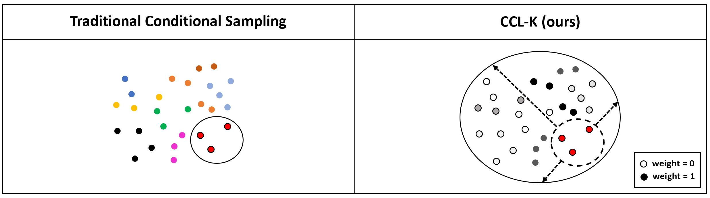

# Conditional Contrastive Learning objectives with Kernel Expressions (CCL-K)
## Official Pytorch Implementation of CCL-K

We propose CCL-K for conditional contrastive learning frameworks. Three settings are considered
- WeaklySup-CCLK
- Fair-CCLK
- HardNeg-CCLK 


# Dataset locations
The dataset file locations should be specified in a JSON file of the following form
```
{
    "cifar10": "data/Cifar/datafolder",
    "imagenet": "data/imagenet100/datafolder",
    "cub": "data/CUB/datafolder",
    "utzappos": "data/UTzappos-sub/datafolder",
    "colorMNIST": "data/colormnist/datafolder"
}

```

# Running with WeaklySup-CCLK
- Condition on Discrete Variables
`attribute_data_root_folders.json` should be configured to be the root folder of the attribute datasets and `attribute_pd_paths.json` contains the csv files that pointing out the relative location (w.r.t. root) of each data, and the discrete attributes associated with it. We include processed `.csv` file that can pointed to directly in `attribute_pd_paths.json`.
    ```
    attribute_data_root_folders.json:
    {
        "cub": "data/CUB/images",
        "utzappos": "data/UTzappos-sub/ut-zap50k-images-square"
    }
    ```

    ```
    attribute_pd_paths.json:
    {
        "cub": "data/CUB/meta_data_bin_train.csv",
        "utzappos": "data/UTzappos-sub/meta_data_bin_train.csv"
    }
    ```
    Then Run WeaklySup-CCLK with discrete variables:
    ```
    python3 cclk_weaklysup_attributes.py --cosine-anneal --filename output.pth --base-lr 1.5 --test-freq 50 \
    --lambda_ 0.01 \
    --num-epochs 1000 \
    --inverse_device gpu \
    --batch-size 152 \
    --distance_mode cosine \
    --customized_name WeaklySup-Discrete \
    --dataset utzappos \
    --condition_mode cl-infonce \
    ```


- Condition on Continuous Features
    First make sure you have the neccessary continuous feature. We extract features from OpenAI CLIP network to serve as a continous variable to condition upon. Store them in a pickle file and point them to `condition_continuous_feat.json`
    ```
    {
        "imagenet100-clip": "data/imagenet100/features.pkl"
    }
    ```

    Then run the conditional contrastive learning with WeakslySup-CCLK:
    ```
    python3 cclk_weaklysup_continuous_features.py --cosine-anneal --filename output.pth --base-lr 1.5 --test-freq 20 \
    --lambda_ 0.01 \
    --num-epochs 200 \
    --distance_mode cosine \
    --inverse_device gpu \
    --batch-size 128 \
    --customized_name WeaklySup-Continuous \
    --dataset imagenet100-clip \
    --condition_mode cl-infonce \
    ```


# Running with Fair-CCLK
```
python3 cclk_fair.py --cosine-anneal --filename output.pth --base-lr 1e-3 --test-freq 1 \
--lambda_ 0.01 \
--num-epochs 1000 \
--inverse_device gpu \
--batch-size 256 \
--temperature 0.1 \
--distance_mode RBF \
--condition_mode weac-infonce \
--customized_name RBFK-Fair \
--no_color_distor \
--dataset colorMNIST \
--arch LeNet \
```


# Running with HardNeg-CCLK
```
python3 cclk_hardnegatives.py --cosine-anneal --filename output.pth --base-lr 1.5 --test-freq 5 \
--lambda_ 100 \
--num-epochs 200 \
--inverse_device gpu \
--save_freq 10 \
--distance_mode RBF \
--batch-size 512 \
--num-workers 15 \
--dataset imagenet100 \
--customized_name RBF-HardNegtive \
--temp_z 500 \
```
